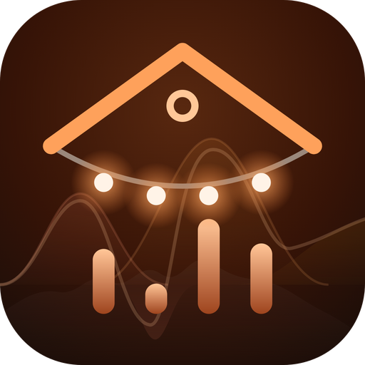

<p align="center">
  
</p>

<h1 align="center">MusicalLights</h1>

<p align="center">
  <strong>Make your Home Assistant lights follow the music.</strong>
</p>

Open a web page on a phone or laptop, toggle it on, and the room's lights pulse with the
bass, mids and treble the mic hears.

- **Three bands, one light each (or several).** Bass, mid and treble levels drive light
  brightness. On/off devices (plugs, switch-backed lamps) turn on when their band crosses a
  threshold.
- **No Home Assistant automations.** You add one toggle helper, which the app turns on for
  the duration of a session, so your own automations can keep their hands off the lights
  while music is playing.
- **Leaves your lights as they were.** When a session stops, each light is restored. That
  includes the page being closed or the phone locking, and the toggle being turned off
  inside HA.
- **Paced for real bulbs.** Wi-Fi and cloud lights drop commands if flooded, so updates are
  rate-capped per light, and switches get hysteresis and a minimum hold so relays don't
  chatter.

```
browser (mic → FFT → bass/mid/treble 0..1) ──WebSocket──► musical-lights ──HA WebSocket──► lights
```

The browser does all the audio processing. The server holds the HA token and paces every
command.

## Quick start

Requirements: Docker with Compose v2.24+, and a Home Assistant the container can reach.

1. **In Home Assistant:**
   - Create a toggle helper (Settings → Devices & services → Helpers → Create helper →
     Toggle) named **MusicalLights**. This gives you `input_boolean.musicallights`.
   - Create a long-lived access token (your profile → Security → Long-lived access tokens).
2. **Configure and start:**

   ```sh
   git clone https://github.com/null-p01ntr/musical-lights.git
   cd musical-lights
   cp .env.example .env        # set HA_URL, HA_TOKEN, CERT_SAN, optionally ML_LIGHTS
   docker compose up -d        # .env's COMPOSE_FILE layers compose.prod.yaml: pulls ghcr.io/null-p01ntr/musical-lights, publishes the port
   ```

3. Open `https://<host>:8445` and accept the self-signed certificate once. Browsers only
   allow microphone access over HTTPS, so the container generates a certificate into
   `./data/certs` on first start.
4. Add lights on the **Settings** page if you didn't set `ML_LIGHTS`, then flip the toggle on
   the main page.

## Configuration

`.env` (see `.env.example`):

| Variable | Default | Notes |
|---|---|---|
| `HA_URL` | `http://homeassistant.local:8123` | Use `http://host.docker.internal:8123` when HA runs on the same host with host networking |
| `HA_TOKEN` | unset | Long-lived access token |
| `HA_HELPER` | `input_boolean.musicallights` | Turned on during a session |
| `ML_LIGHTS` | unset | **First run only.** `entity:band[:threshold]`, comma-separated, e.g. `light.strip:bass,switch.plug:treble:80` |
| `ML_PORT` | `8445` | Host port |
| `CERT_CN` / `CERT_SAN` | `musical-lights` / `DNS:localhost,IP:127.0.0.1` | Put the name/IP you browse to in the SAN. Delete `data/certs` to regenerate |
| `LOG_LEVEL` | `INFO` | |

`HA_URL`, `HA_TOKEN` and `HA_HELPER` **override** the Settings page and lock those fields
there. Leave them unset to configure them in the UI instead. Everything else lives in
`./data/settings.json` and is edited on the Settings page:
- the light list: band, min/max brightness, on/off threshold, enabled;
- the band frequency ranges (default bass 20–250 Hz, mid 250–4000 Hz, treble 4000–16000 Hz);
- sensitivity, smoothing, auto-gain;
- output pacing: max updates/s per light (default 4), deadband (4%), switch minimum hold
  (1 s), and the no-audio watchdog (6 s).

The token is never returned by the API or shown in the UI.

## Keeping your automations out of the way

While `input_boolean.musicallights` is on, anything else that sets these lights will fight
the app. Guard those automations yourself. The app deliberately doesn't create or edit
automations.

**An automation that only touches the music lights:** add a condition.

```yaml
conditions:
  - condition: not
    conditions:
      - condition: state
        entity_id: input_boolean.musicallights
        state: "on"
```

Use `not … on` rather than `state: off`, so an `unavailable` helper (HA still starting)
doesn't block your house.

**A sweep over an area or a list:** give the music lights a label (e.g. `musicallights`) and
drop them from the target while a session runs.

```yaml
target:
  entity_id: >
    {{ area_entities('living_room') | select('match', 'light.')
       | reject('in', label_entities('musicallights') if is_state('input_boolean.musicallights', 'on') else [])
       | list }}
```

Also, **if your automations turn the helper off, the session ends** and the lights are
restored. That makes it a clean way for, say, an "everyone left" automation to take the
lights back.

## How it behaves

- **Audio.** Web Audio `AnalyserNode` with a 4096-point FFT. Each band's level is its mean
  power in dB. With auto-gain on, that is mapped against a slowly decaying peak (30 dB of
  range at sensitivity 1), so quiet and loud rooms both use the full range. Attack is
  instant and release is smoothed.
- **Dimmable lights** get `min + level × (max − min)` percent brightness. **On/off
  lights** turn on at `level ≥ threshold` and off below `threshold − 10`, after at least
  the minimum hold. Colour is never changed.
- **A session:**
  1. Turn the helper on.
  2. Wait 1 s, so automations reacting to the helper settle.
  3. Snapshot every light.
  4. Drive the lights.
  5. Restore on/off and brightness.
  6. Turn the helper off.

  A session ends on the toggle, after 6 s with no audio, when the helper is turned off in
  HA, or when the container stops. If the container restarts mid-session, it turns a
  leftover helper off on reconnect.
- **Keep the page open.** The page asks for a screen wake lock, but if the device sleeps
  anyway, audio stops and the watchdog ends the session.

## API

| Method | Path | |
|---|---|---|
| GET | `/api/health` | liveness + HA connection |
| GET | `/api/status` | session, levels, per-light output |
| POST | `/api/start`, `/api/stop` | session control |
| GET / PUT | `/api/settings` | bands, audio, output, HA (token write-only) |
| POST | `/api/lights` | `{"entity_id", "band", "threshold"?}` |
| PUT / DELETE | `/api/lights/{entity_id}` | |
| GET | `/api/entity/{entity_id}` | HA lookup + detected dimmable/on-off |
| WS | `/ws` | client → `{"type":"levels","bass","mid","treble"}`; server → state at 10 Hz |

## Security

There is **no login.** Anyone who can reach the port can drive the configured lights and
change the settings (but can't read the token). It is meant for a trusted home LAN. Don't
expose it to the internet.

## Development

```sh
pip install -r requirements.txt
python -m unittest discover -s src/tests -v     # 23 tests against a fake Home Assistant, no real HA needed
```

Or inside the image:
`docker compose run --rm --no-deps --entrypoint python musical-lights -m unittest -v tests.test_app`.

## License

MIT, see `LICENSE`.
